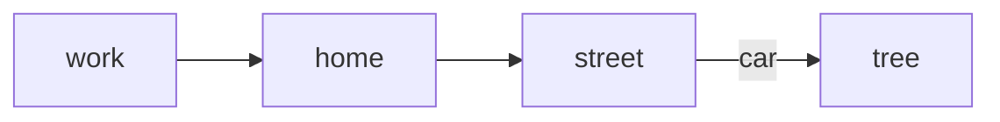
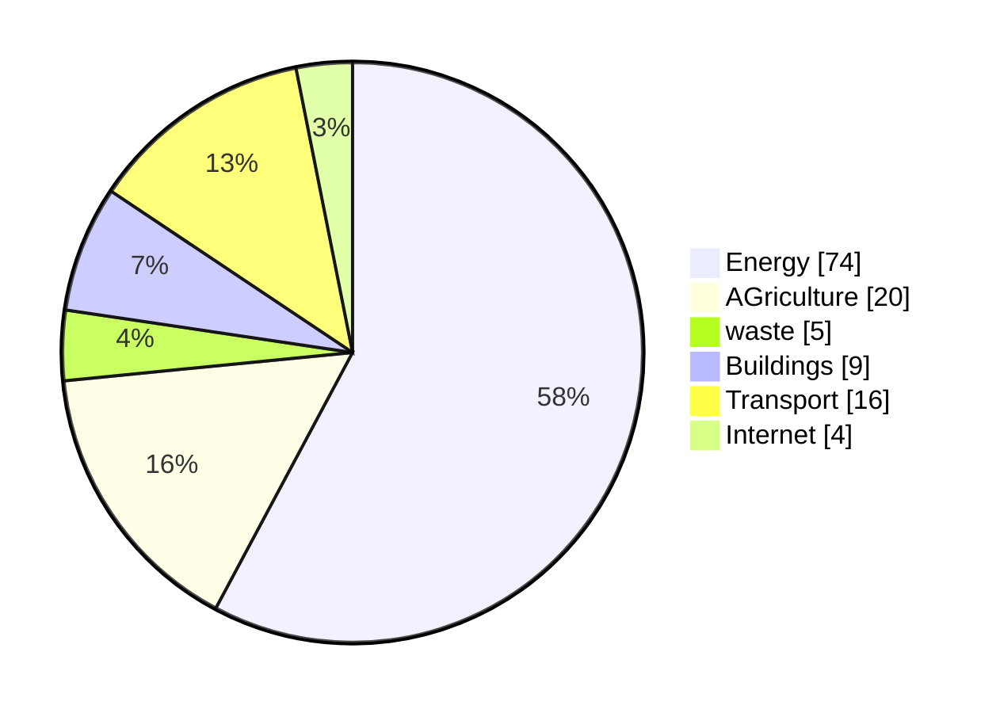
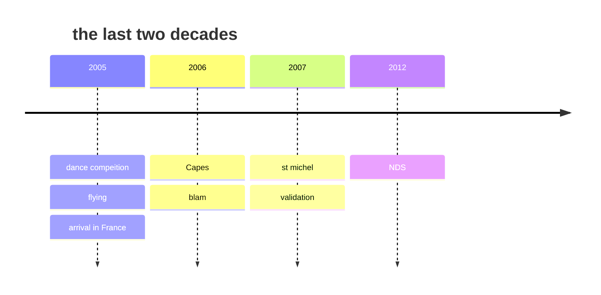
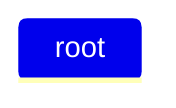

| Column 1 | Column 2 | Column 3 |
| -------- | -------- | -------- |
| Text     | Text     | Text  balh blah blhab ablhalshblhasldkfjlaljfdkfjsl <br> another blah blah  |
| text 2   | blah | huh???|
|bamm     | boom | biim |

- [ ] do this
- [ ] do that
- [x] do teh toher hting?

> and hten he said, wtf dude?

Let's do some python [^1]
[^1]: Python is a programming language that is so cool.

```python=5
print("hello world")
def vitesse(x,v):
    ax + bx^2
    return vitesse
```

### small headign
This is goign to be **quite** interesting *no?*

:::info

Do this but dont that
:::

:::warning
Do NOT do that.
:::

:::danger
You did that!!!
:::

:::success
yay!
:::




```markmap!
## here is the root
- branch 1
- branche 2
### here is three things
- stuff inside 3
- stuff inside 4

## here is 4 things !
```


a bit of math now?
$$ y = x + \frac{d^2x}{dt^2} = \frac{\partial^2 y}{\partial x}$$

```abc!
ABabcCcC | Ddef^f_A | C[ce^gC]
```





```mermaid!
journey
    title me study housework
    but again not
```



Let's do a foonote. I wanna put it here. [^footnote]

[^footnote]: This is where the first footnote goes. i wonder if it's any good.

2 <sup>55-33</sup>


>[!Important]
>Here is somethign importnat to remember

>[!Tip]
> Here is somethign about color
`#ffffff`
`#687111`

>[!Warning]

>[!Caution]


[Back to top](#top)
[:arrow_up:](#top)
