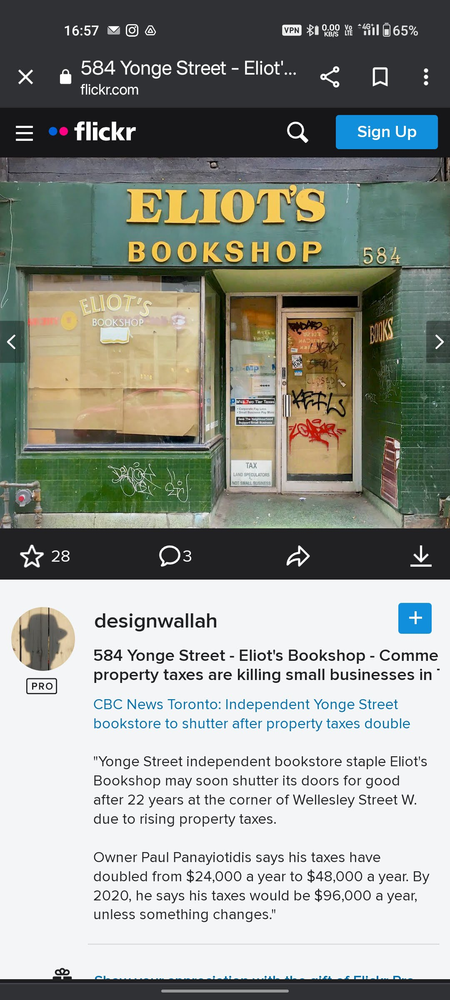
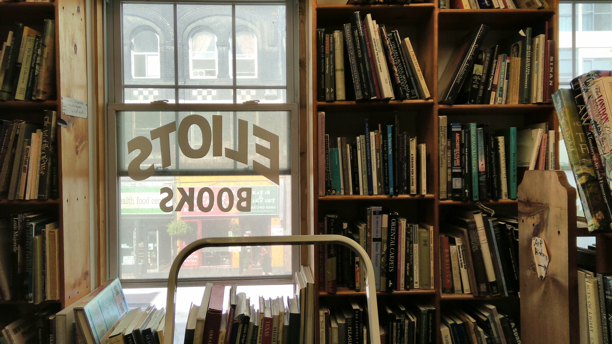

> **Featured Photo**: 
Looking down at a miniaturized Mid-town Toronto || f/5 || 1/5s || ISO800 || 29 mm || Nikon D7200 || 2024 
{: .prompt-info }

## A Sadness pervades

I'm generally glad to be heading to Toronto during my summer breaks. Seeing family and friends is *of course* top of the line, but so is seeing *the city*, since one of my predilections has always been used-book shopping in this lovely city I grew up in. I have my haunts that I had discovered in my university years and have frequented since. I cannot recount the number of hours i'd spent at ***Eliot's Book shop*** or at ***Seeker's books***, nor what portion of my own personal library was built from them (not to mention all the others, *Ten Edition Books*, *ABC books*, *NDJ books*, *Abelards* ...). 

### Changing times 

Over the years, however, the feeling that I will have, coming to Toronto as I do most summers, has transformed from *looking forward* into something more akin to *dread*. \begin{old man rant} *Every single time I come back, things are changing, more quickly than I would like and definitely in the wrong direction* \end{old man rant}.  The city is changing, and having left it 20 years ago, each time I come back a piece of it - and with it a piece of me with it - is torn away, brought down and replaced with ... high rises. This one is goig to be 80 floors on this corner. And the next year in the opposite corner there's gonna be one that is 82 floors, from a rival developer ... *of course*. And how do we manage it? well it's easy, we'll raze de block and all the old houses and shoppes that have been there for all these decades. Oh yea and this will in *no way* fix the housing problems in Toronto, and indeed make it worse. Good job guys! 

{: .w-50 .right}
_This is what happens in our societies now_

It really hit home when a few years ago i came back and went down Yonge street to Wellesley, heading to ***Eliot's*** with my list of books in hand and stood in shock in front of the boarded up windows of the shop. I learned that in an effort to push out a lot of the local stores and mom and pop shops (who didnt want to leave or sell their property to the developers who craved the well placed terrain) the city (or the province?) had jacked up the property taxes by somethign like 400% over a short period of time. A used book seller cannot survive that. You dont go into selling used and second hand books if you're looking to make money. The kicker was when i came back a couple of years later and once again stood at the address facing the same beloved building, still bearing the old ***Eliot's book shop*** sign, and now hosting a korean restaurant : they hadn't even razed the place to put up a condo like everywhere else ! 

### Damn pandemic ... again 

When i further interrogated the fellow at *Seekers* he brought up COVID as well; and that is another observation that has saddened me. While it is hardly a revelation to say that in most places there has been a "before covid" and an "after covid", i feel it so much more strongly in some places than others, namely Toronto (especially when compared to back in France). It is palpable when you are downtown : the streets feel less dense, as do coffeeshops and restaurants. Closing times are earlier : *Seekers* used to be open 'noon to midnight' and now will close at 9 or even earlier, at times; there are restaurants in *Chinatown* that we used to get food at, at 2 in the morning that now close at 8h30...to name a few examples. 

_My last time inside *Eliot's*_ 

Bookstores obviously havent been spared either, people come out less, they shop in physical stores less, and they interact with shop personnel and sellers less. I can't but wonder how long stores like this will last ... 

## So the summer reading .... ? 

I didnt manage to find a physical copy of "His master's voice" and so had to look for it on the internet, and found it as an ebook, which i'm reading. I will look for it again when i'm back at paris, perhaps i'll have more luck there. The sellers all told me to look on internet, and if i find it to hang on to it. I hate shopping for books - or at least *these types of books* - online. Feels wrong. It's stupid i know. 

As for the book itself ... Oh boy, i think the kids are going to have a **lot** of trouble with it, if they even get to it! 